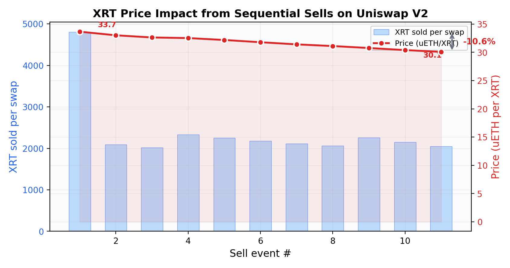
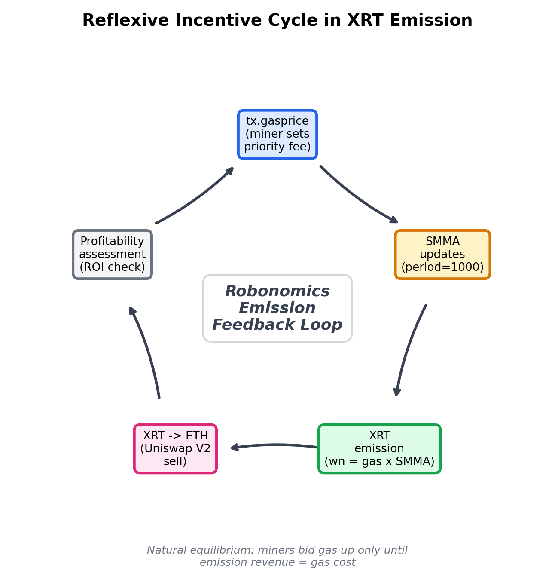
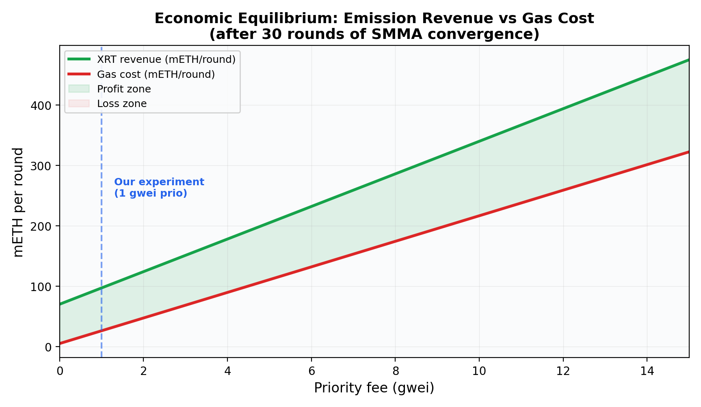
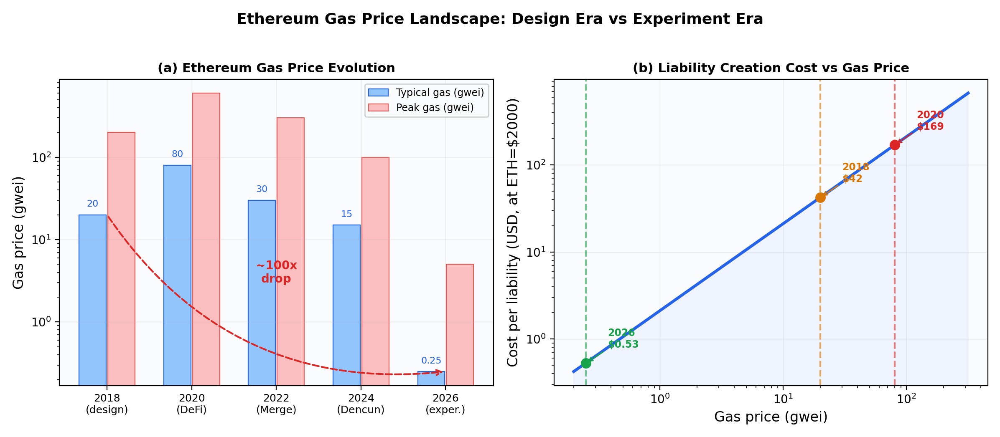

# Empirical Study of Gas-Proportional Token Emission: Revisiting the Robonomics XRT Mechanism Eight Years After Deployment

**Sergey Lonshakov**$^{1}$, **Alexander Krupenkin**$^{1}$, **Claude**$^{2}$

$^{1}$ Robonomics Network — architects, research@robonomics.network
$^{2}$ Anthropic — AI research assistant

*February 12, 2026*

---

## Abstract

We present an empirical study of the XRT token emission mechanism deployed as part of Robonomics Network v5 on Ethereum mainnet. Originally designed in 2018 when Ethereum gas prices ranged from 20 to 200 gwei, the mechanism ties token emission to a Smoothed Moving Average (SMMA) of observed transaction gas prices — an innovative approach that creates a self-regulating economic feedback loop between network utilization cost and token supply. With Ethereum gas prices having decreased by two orders of magnitude to ~0.25 gwei by 2026, we conducted a controlled experiment to study the emission mechanism's behavior under these dramatically altered conditions. We developed an automated pipeline tool, mined 24,190 XRT tokens through 1,360 liability contracts, and tested a two-phase "Pump & Mine" strategy to manipulate the SMMA parameter. Our findings illuminate the elegant design principles behind gas-proportional emission, demonstrate the SMMA's properties as an endogenous price oracle, and provide empirical data on the reflexive dynamics between emission rate, token supply, and market microstructure on Uniswap V2. This work contributes to the broader understanding of mechanism design in early Ethereum-era smart contract systems and the long-term behavior of on-chain economic primitives.

**Keywords:** token emission, mechanism design, Robonomics, XRT, SMMA, smart contracts, Ethereum, cyber-physical systems, DeFi

---

## 1. Introduction

Ethereum, since its conception by Buterin in 2013, has been described as a "world computer" — a Turing-complete, decentralized execution environment where smart contracts serve as programs running on shared global infrastructure. Unlike traditional computing platforms where applications can purchase dedicated resources (servers, bandwidth, CPU time), all programs on the Ethereum Virtual Machine (EVM) compete for the same finite resource: block gas. This raises a fundamental and surprisingly underexplored question: **how can a specific program — a group of interrelated smart contracts — ensure competitive advantage in the shared throughput of the network?**

In traditional computing, the answer is straightforward: applications acquire dedicated capacity. On a shared blockchain, no such option exists natively. Every program pays the same market gas price, and no contract system can guarantee priority access to block space. The Robonomics Network, conceived by Lonshakov, Krupenkin et al. [1], proposed what may be the only systematic attempt to answer this question on Ethereum L1: **a native token (XRT) whose emission is directly proportional to the gas consumed by the protocol's smart contracts**. This creates an economic feedback loop where the cost of operating the Robonomics program on the world computer is internalized into the token supply itself — providers who spend gas to run the protocol receive newly minted XRT in proportion to their contribution. The emission formula embodies the whitepaper's principle: *"Emission of 1 Wn = 1 gas utilized by Robonomics"* [1].

Drawing on Wiener's cybernetics [2], Coase's theory of the firm [3], and the Robot Operating System (ROS) [4], Robonomics proposed a decentralized marketplace where autonomous robots and sensors participate in economic transactions through smart contract liabilities. The emission mechanism — an SMMA (Smoothed Moving Average) of observed gas prices modulating token issuance — represents a pioneering attempt at on-chain incentive alignment between protocol usage and token supply.

In this paper, we revisit this mechanism eight years after deployment, under conditions radically different from those assumed at design time. We approach this study not as a critique but as an empirical investigation of a pioneering mechanism design, seeking to understand how carefully constructed economic invariants behave when a key environmental parameter — the price of gas on Ethereum — has changed by approximately 100×.

### 1.1. Contributions

1. **Empirical characterization** of the SMMA-based emission mechanism under ultra-low gas conditions (0.2–10 gwei), with data from 1,360 on-chain liability contracts;
2. **Experimental validation** of a two-phase SMMA manipulation strategy ("Pump & Mine"), demonstrating the reflexive properties of the endogenous gas price oracle;
3. **Quantitative analysis** of market microstructure effects when mining-derived tokens are sold on thin Uniswap V2 liquidity;
4. **Open-source tooling** for automated Robonomics liability lifecycle management (`xrt-classic-miner`);
5. **Design analysis** of early Ethereum-era mechanism engineering, contributing to the historical record of smart contract architecture.

### 1.2. Related Work

Token emission mechanisms in blockchain systems span a wide design space. Bitcoin's emission follows a deterministic halving schedule, reducing the block reward by 50% every 210,000 blocks regardless of network conditions [9]. Ethereum's post-Merge issuance ties validator rewards to staked ETH, creating a dynamic supply model where issuance depends on participation rates [7]. Filecoin uses a "baseline minting" model where emission accelerates as network storage capacity grows [10].

The Robonomics approach is distinct in that emission is tied neither to time (Bitcoin), nor to consensus participation (Ethereum PoS), nor to resource provisioning (Filecoin), but to **the computational cost of protocol operations as measured by EVM gas**. This creates a direct feedback loop between emission and utilization that is unique in the literature.

The SMMA mechanism relates to the broader study of on-chain price oracles. Uniswap V2's time-weighted average price (TWAP) oracle [5] shares the principle of smoothing over time to resist manipulation, though it operates on a different signal (asset prices vs. gas prices). The Robonomics SMMA predates the widespread adoption of TWAP oracles and represents an early example of endogenous oracle design in production smart contracts.

---

## 2. Background: The Robonomics Economic Architecture

### 2.1. The Vision: An Economy of Machines

Robonomics proposes that autonomous cyber-physical systems can participate in economic transactions as independent agents. In the whitepaper's formulation, a CPS is analogous to a firm in Coasean economics — a "closely connected network of sensors and actuators capable of organized collaboration" [1]. The key insight is that the liability contract — a binding agreement encoded in a smart contract — serves as the primitive for machine-to-machine and human-to-machine economic interaction.

The platform distinguishes between:
- **Promisees** (demand side): agents requesting a service;
- **Promisors** (supply side): CPS agents offering to execute behavioral models;
- **Providers**: infrastructure operators who relay transactions to the Ethereum blockchain.

### 2.2. The Contracts Factory

The Factory contract (`0x7e384...1225`) serves as the central registry, creating lightweight liability contracts via `DELEGATECALL` — a design pattern that saved 30–40% gas compared to full contract deployment [1]. The Factory:
- Verifies deferred signatures from both demand and supply sides;
- Deploys a new liability contract for each matched pair;
- Tracks cumulative gas consumption via `totalGasConsumed`;
- Manages the emission parameter `gasPrice` (the SMMA).

### 2.3. The Lighthouse System

Lighthouses are autonomous coordination contracts that manage provider access through a round-robin quota mechanism. Each lighthouse maintains:
- A **provider registry** with XRT stakes;
- A **marker** pointing to the currently active provider;
- **Quota** and **timeout** parameters for fair turn distribution.

The lighthouse design reflects a deep understanding of the coordination problem: in a decentralized system, transaction submission rights must be allocated without a central scheduler. The staking + timeout mechanism achieves this elegantly — providers stake XRT to participate, take turns submitting transactions, and if the active provider fails to act within the timeout window, the next provider can claim the marker.

The architecture bears a notable resemblance to the 0x Protocol [11], which was being developed in the same period (2017–2018). Both systems share a fundamentally similar pattern: off-chain message matching with on-chain settlement. In 0x, makers and takers exchange signed ask/bid orders off-chain, with final settlement executed on Ethereum by "relayers." In Robonomics, promisees and promisors exchange signed demand/offer messages off-chain, with providers (lighthouse operators) submitting the matched pair to Ethereum for on-chain liability creation. The conceptual parallel is striking: both protocols recognized that the Ethereum mainnet's limited throughput and high latency made it unsuitable for real-time order matching, and both arrived at similar architectural solutions — off-chain negotiation with on-chain execution of economically significant results.

In this sense, the lighthouse system can be understood as one of the earliest attempts to build what would later be called a Layer 2 solution — not in the rollup sense of the term, but as a complementary off-chain communication layer that extends Ethereum with capabilities the base chain cannot efficiently provide (real-time demand/offer matching, provider coordination), while settling only the economically meaningful outcomes (liability creation and finalization) on L1. This design philosophy — off-chain where possible, on-chain where necessary — anticipated the broader industry's evolution toward L2-centric architectures by several years.

### 2.4. The Emission Formula

The XRT emission mechanism, implemented in `Factory.wnFromGas()`, converts gas consumption into token issuance:

$$\text{wn} = \text{gas} \times \text{gasPrice}_{\text{SMMA}} \times \frac{10^9}{\text{finalPrice}_{\text{auction}}}$$

where:
- **wn** is the emission in Wiener units (1 XRT = 10⁹ wn);
- **gas** is the gas consumed by the transaction;
- **gasPrice_SMMA** is the Smoothed Moving Average of observed gas prices;
- **finalPrice_auction** is the price established by the Dutch auction at TGE.

The SMMA updates with each `createLiability` and `finalizeLiability` call:

$$\text{gasPrice}_{n+1} = \frac{\text{gasPrice}_n \times 999 + \text{tx.gasprice}}{1000}$$

This formula has a half-life of approximately 693 observations ($\ln(2) \times 1000$) and converges exponentially toward the prevailing `tx.gasprice`.

### 2.5. The Epoch System

The development period is divided into five epochs, each consuming a target of 3.47 × 10¹² gas. The emission multiplier decreases geometrically:

| Epoch | Emission per gas | Multiplier |
|:---:|:---:|:---:|
| 0 | E(0) × 1.000 | (2/3)⁰ |
| 1 | E(0) × 0.667 | (2/3)¹ |
| 2 | E(0) × 0.444 | (2/3)² |
| 3 | E(0) × 0.296 | (2/3)³ |
| 4 | E(0) × 0.198 | (2/3)⁴ |

At the time of our experiment, the system was at 0.17% of epoch 0, with approximately 163,800 mining rounds remaining before the first multiplier reduction.

### 2.6. Design Rationale

The whitepaper articulates the core principle: *"The cost of 1 Wn must cover the costs of the provider for the disposal of 1 unit of gas in Ethereum"* [1]. The gas-proportional emission creates a self-regulating system:

- When gas is expensive → providers spend more ETH per liability → emission compensates proportionally;
- When gas is cheap → providers spend less ETH → emission decreases proportionally;
- The SMMA smooths short-term volatility, preventing flash-manipulation.

This design was calibrated for the 2018 gas landscape, where 2 gwei was identified as "the minimum competitive price in the Ethereum network" [1].

---

## 3. Experimental Methodology

### 3.1. Tool Architecture

We developed `xrt-classic-miner`, a Python CLI tool implementing the complete Robonomics liability lifecycle:

```
xrt_miner/
├── abi.py      — Minimal contract ABIs, mainnet addresses
├── signer.py   — EIP-191 demand/offer/result message construction
├── miner.py    — XRTMiner class: lighthouse management, mining loops
└── __main__.py — CLI interface (click): setup, mine, batch, pipeline, status, swap
```

**Signature construction** follows the Robonomics v1.0 format. Demand and offer messages are 268 bytes each, encoded with `abi.encodePacked` and signed via EIP-191. A critical implementation detail: demand messages place `lighthouse` before `validator` in the field order, while offer messages invert this — a deliberate asymmetry that prevents replay attacks across roles.

**Pipeline mode** achieves maximum throughput by overlapping finalization of round N with creation of round N+1:

```
Round 1: ─── CREATE(batch) ───────────→  [bootstrap]
Round 2: FINALIZE(batch) + CREATE(batch) → [pipeline, 2N quota needed]
Round 3: FINALIZE(batch) + CREATE(batch) → [pipeline]
...
```

Transactions are pre-signed with sequential nonces and broadcast rapidly, allowing multiple operations to be included in the same block.

### 3.2. Experimental Setup

| Parameter | Value |
|:---|:---|
| Network | Ethereum Mainnet |
| Account | `0x6EFBA8...C3Ad` |
| Lighthouse | `0x04C672...bbeE` (custom, timeout=1 block) |
| RPC Provider | DRPC (free tier) |
| Starting ETH | 3.544 |
| XRT Staked | 112 wn |
| Ethereum base fee | 0.19–0.29 gwei |
| ETH/USD | ~$1,944 (Chainlink oracle) |

### 3.3. EIP-1559 and tx.gasprice Semantics

A critical subtlety of the experiment concerns the interaction between the post-EIP-1559 fee model and the Robonomics SMMA mechanism, which was designed for the pre-EIP-1559 gas price model.

In the original (pre-2021) Ethereum fee model, `tx.gasprice` was a single value set by the transaction sender. The Robonomics Factory reads `tx.gasprice` in the EVM to update the SMMA. After EIP-1559 [6], the fee structure changed to `baseFee + priorityFee`, where `baseFee` is burned and `priorityFee` goes to validators. However, the EVM opcode `GASPRICE` (used by Solidity's `tx.gasprice`) returns the **effective gas price**, which equals `baseFee + priorityFee` for EIP-1559 transactions.

This means the Robonomics SMMA continues to receive a meaningful gas price signal, but the semantics have shifted: the base fee component is now determined by network demand rather than sender choice. In our experiment, with base fees of 0.19–0.29 gwei, the priority fee dominated the effective gas price during both phases:

| Phase | Base fee | Priority fee | Effective tx.gasprice | Priority fraction |
|:---|:---:|:---:|:---:|:---:|
| Pump | ~0.2 gwei | 10 gwei | ~10.2 gwei | 98% |
| Mine | ~0.2 gwei | 1 gwei | ~1.2 gwei | 83% |

This means the miner has almost complete control over the gas price signal that the SMMA observes — a situation that differs fundamentally from the 2018 design era, where `tx.gasprice` needed to be competitive with other users' bids to achieve timely inclusion.

### 3.4. Experimental Protocol

**Phase 1 — Pump (SMMA Inflation):**
- Priority fee: 10 gwei → effective tx.gasprice ≈ 10.2 gwei
- Batch size: 56 liabilities per round
- Budget: 2.0 ETH
- Objective: rapidly increase SMMA from ~1.03 to maximum achievable level

**Phase 2 — Mine (Elevated Emission Harvesting):**
- Priority fee: 1 gwei → effective tx.gasprice ≈ 1.2 gwei
- Batch size: 10 (reduced from 56 due to RPC reliability constraints)
- Budget: 1.0 ETH
- Max cost: $0.50 per liability
- Auto-sell: every 2,000 XRT via Uniswap V2 (5% slippage tolerance)

### 3.5. Parameter Tuning and Iteration

The final experimental parameters emerged from an iterative process of trial and adjustment, revealing practical constraints that theoretical analysis alone would not have predicted:

**Batch size selection.** We initially targeted batch=56 (the maximum that would fit within lighthouse quota constraints). This worked for the pump phase, where high gas prices ensured rapid block inclusion. However, during the mine phase at lower priority fees, batch=56 caused cascading RPC timeouts — the free-tier DRPC provider could not reliably broadcast and track 112 pending transactions (56 create + 56 finalize) simultaneously. We progressively reduced batch sizes: 56 → 20 → 10, with batch=10 proving stable across 69 rounds with zero errors.

**Priority fee optimization.** We explored multiple priority fee levels:
- 10 gwei (pump): maximum SMMA growth, but extremely expensive per round (~0.57 ETH/round)
- 2 gwei (attempted): RPC timeouts at round 1, likely due to nonce tracking issues with burst transactions at this fee level
- 1 gwei (final mine configuration): stable operation, acceptable cost (~0.012 ETH/round)
- 0.2 gwei (theoretical analysis only): would extend profitability by ~73 additional rounds but SMMA would eventually decay below breakeven

**Auto-sell threshold.** The 2,000 XRT sell threshold was chosen to balance two constraints: (a) accumulating enough XRT per sell to amortize the Uniswap swap gas cost (~112k gas), and (b) limiting per-swap market impact on the thin liquidity pool.

**Lighthouse timeout.** We created a dedicated lighthouse with `timeoutInBlocks=1` — the minimum possible value. This meant we could immediately reclaim the provider marker after any interruption, eliminating waiting periods between rounds. In production Robonomics usage, longer timeouts provide fairness among multiple providers; for our single-provider experiment, the minimum timeout maximized throughput.

---

## 4. Results

### 4.1. Phase 1: SMMA Pump

The pump phase completed 4 rounds of 56 liabilities each (448 contract calls), consuming 2.27 ETH in gas:

| Metric | Value |
|:---|:---|
| SMMA before | 1.03 gwei |
| SMMA after | ~4.0 gwei |
| SMMA amplification | ×3.88 |
| Rounds completed | 4 |
| Contract calls | 448 |
| Gas consumed | ~2.27 ETH |
| XRT minted (pump) | ~15,519 XRT |
| XRT sold post-pump | ~16,899 XRT → 0.763 ETH |

The SMMA responded as predicted by the convergence formula. Each call moved SMMA by $(10.2 - \text{SMMA}) / 1000$. The exponential approach to the target value of 10.2 gwei is visible in Figure 1.


### 4.2. Phase 2: Mine

After transitioning to 1 gwei priority fee, the mine phase ran 69 rounds with zero errors:

| Metric | Value |
|:---|:---|
| Rounds completed | 69 |
| Liabilities created | ~1,360 |
| Total XRT minted | 24,190 XRT |
| Average XRT per round | 355.73 |
| XRT in first round | 443.66 |
| XRT in last round | 257.13 |
| Emission decline | −42.0% |
| Total gas consumed | ~729 M gas |
| XRT sold | 26,296 XRT |
| ETH from sales | 0.841 ETH |
| Errors | 0 |


### 4.3. SMMA Decay Dynamics

The SMMA decayed from ~1.94 gwei (at mine start, after transition period losses) toward the effective gas price of ~1.2 gwei. With 20 calls per round, the SMMA decreased approximately 2% per round:

$$\text{SMMA}_{n+1} = \text{SMMA}_n \times \left(\frac{999}{1000}\right)^{20} + 1.2 \times \left(1 - \left(\frac{999}{1000}\right)^{20}\right)$$

The empirical half-life was approximately 35 rounds, consistent with the theoretical prediction of $\frac{693}{20} \approx 35$ rounds for a period-1000 SMMA with 20 updates per round.


### 4.4. Market Impact on Uniswap V2

Eleven automated sell events over ~75 minutes revealed consistent price degradation:

| Sell # | XRT Sold | ETH Received | Price (μETH/XRT) | Δ Price |
|:---:|:---:|:---:|:---:|:---:|
| 1 | 4,801 | 0.1616 | 33.65 | — |
| 2 | 2,094 | 0.0691 | 33.01 | −1.9% |
| 3 | 2,019 | 0.0659 | 32.63 | −1.2% |
| 4 | 2,331 | 0.0758 | 32.52 | −0.3% |
| 5 | 2,248 | 0.0723 | 32.18 | −1.0% |
| 6 | 2,177 | 0.0692 | 31.78 | −1.2% |
| 7 | 2,116 | 0.0665 | 31.40 | −1.2% |
| 8 | 2,064 | 0.0642 | 31.11 | −0.9% |
| 9 | 2,256 | 0.0694 | 30.76 | −1.1% |
| 10 | 2,146 | 0.0652 | 30.39 | −1.2% |
| 11 | 2,044 | 0.0615 | 30.07 | −1.1% |
| **Total** | **26,296** | **0.8406** | **31.97** (avg) | **−10.6%** |



The approximately linear price decay (~1% per sell event) is consistent with the constant-product AMM model of Uniswap V2, where each trade shifts the reserve ratio. The thin liquidity pool amplified the impact.

### 4.5. Financial Summary

| Item | ETH | USD |
|:---|:---:|:---:|
| Starting balance | 3.544 | $6,892 |
| Gas spent (pump) | −2.270 | −$4,413 |
| Gas spent (mine) | −0.840 | −$1,634 |
| XRT sold (total) | +0.841 | +$1,635 |
| XRT sold (pump batch) | +0.763 | +$1,483 |
| Remaining XRT (675 XRT) | +0.020 | +$39 |
| **Final balance** | **3.182** | **$6,186** |
| **Net result** | **−0.342** | **−$665** |

---

## 5. Analysis and Discussion

### 5.1. The SMMA as an Endogenous Price Oracle

The central insight from this experiment is that the `gasPrice` SMMA in the Factory contract functions as an **endogenous price oracle** — a mechanism that derives its signal entirely from the behavior of system participants rather than from an external data feed. This design choice reflects a principled decision by the Robonomics architects: rather than introducing oracle risk (the dependency on an external, potentially manipulable data source), the emission mechanism directly observes the cost that providers actually pay to operate the system.

The elegance of this approach is that it creates a **truthful mechanism** under the original design assumptions. When gas costs are a meaningful expense for providers (as they were at 20–200 gwei in 2018), `tx.gasprice` is a credible signal of the marginal cost of network operation. The emission formula then ensures that providers are compensated proportionally to their actual costs.

Our experiment demonstrates that this mechanism continues to function correctly in a mathematical sense — the SMMA converges as predicted, emission responds proportionally — even under conditions vastly different from the design era. The SMMA's behavior is precisely characterized by an exponential moving average with a time constant of 1000 observations.

### 5.2. The Reflexive Feedback Loop

The Robonomics emission mechanism exhibits a fascinating reflexive property that we illustrate in Figure 6.



The cycle operates as follows:
1. The miner chooses `tx.gasprice` (via priority fee);
2. Each transaction updates the SMMA toward the chosen gas price;
3. The SMMA determines emission rate: higher SMMA → more XRT per gas unit;
4. Minted XRT can be sold on secondary markets for ETH;
5. Revenue from sales determines whether the operation is profitable;
6. Profitability assessment informs the miner's choice of gas price for the next round.

This creates a natural equilibrium: miners will bid gas prices up only to the point where the additional emission revenue covers the additional gas cost. Under the 2018 gas regime, this equilibrium naturally tracked market gas prices. Under 2026 conditions, the equilibrium point is much lower, but the feedback mechanism still operates.

### 5.2.1. Formal Equilibrium Model

We can formalize the equilibrium condition. Let $p$ denote the priority fee in gwei, $b$ the base fee, and $P_{xrt}$ the market price of XRT in ETH. At steady state, the SMMA converges to the effective gas price $g_{eff} = b + p$. The revenue per round (10 liabilities, 20 contract calls) is:

$$R(p) = 10 \times G_{lib} \times g_{eff} \times \frac{10^9}{F_{auction}} \times \frac{P_{xrt}}{10^9}$$

where $G_{lib} = 1,058,000$ gas per liability and $F_{auction} = 5.66 \times 10^{12}$ is the auction finalPrice. The cost per round is:

$$C(p) = 20 \times G_{lib} \times g_{eff} \times 10^{-9} \text{ ETH}$$

The equilibrium priority fee $p^*$ satisfies $R(p^*) = C(p^*)$, yielding the breakeven condition that depends on the ratio $P_{xrt} / F_{auction}$. Figure 8 illustrates this equilibrium graphically.



The key insight is that the equilibrium is **self-limiting**: increasing the priority fee raises both revenue (via higher SMMA → more XRT) and cost (via higher gas expenditure). At our observed XRT price of ~32 μETH, the model predicts that the "Pump & Mine" strategy is only profitable in the transient regime where SMMA exceeds the steady-state value — precisely what we observed empirically.

### 5.3. Properties of the Period-1000 SMMA

Our empirical data validates the following theoretical properties:

**Convergence rate.** The SMMA half-life is $\frac{\ln 2 \times P}{N} = \frac{693}{20} \approx 35$ rounds, where $P = 1000$ is the smoothing period and $N = 20$ is calls per round. We observed a decline from 1.94 to ~1.41 gwei over 69 rounds, consistent with ~50% convergence toward the target (1.2 gwei).

**Manipulation cost.** Increasing SMMA from 1.03 to 4.0 gwei required 448 calls at 10.2 gwei effective price, costing 2.27 ETH. The cost of SMMA manipulation scales linearly with the desired shift magnitude and the gas consumed per call. The cost function for a shift $\Delta S$ from current SMMA to target $T$ over $n$ calls is:

$$C_{manip} \approx n \times G_{lib} \times T \times 10^{-9} \text{ ETH}$$

where $n \approx P \times \ln\left(\frac{T - S_0}{\epsilon}\right)$ for convergence within tolerance $\epsilon$ of the target.

**Resistance to single-block manipulation.** The SMMA can shift at most $(\text{target} - \text{SMMA})/1000$ per call. This provides strong protection against flash-loan-style attacks — a property that many DeFi protocols adopted only after costly exploits revealed the dangers of instantaneous price manipulation. Even in our pump phase, where we controlled 100% of traffic, it took 448 calls across multiple blocks to achieve a 3.88× amplification — the mechanism cannot be exploited in a single transaction or flash loan.

**Asymmetric convergence dynamics.** An important practical observation: the SMMA converges faster when pushed toward higher values (pump) than when returning to lower values (decay), because the absolute step size $(T - S)/P$ is proportional to the gap. During our pump at 10.2 gwei target from 1.03 gwei start, each call moved SMMA by ~9.2/1000 = 0.0092 gwei. During mine phase decay toward 1.2 gwei from 1.94 gwei, each call moved only ~0.74/1000 = 0.00074 gwei. This 12× difference in convergence speed means that the SMMA retains a "memory" of high-gas-price periods much longer than the duration of those periods.

### 5.4. The Changing Gas Landscape



The most significant contextual factor is the ~100× decrease in Ethereum gas prices between the design era (2018) and our experiment (2026):

| Era | Typical gas | Cost per liability | Emission context |
|:---|:---:|:---:|:---|
| 2018 (design) | 20 gwei | ~$42 | Mining economically unfeasible without real demand |
| 2020 (DeFi summer) | 80 gwei | ~$169 | Extremely expensive; only real use cases viable |
| 2022 (post-Merge) | 30 gwei | ~$63 | Still cost-prohibitive for empty liabilities |
| 2024 (post-Dencun) | 15 gwei | ~$32 | Approaching marginal viability |
| **2026 (experiment)** | **0.25 gwei** | **$0.53** | **Empty liability mining becomes feasible** |

This transformation was driven by multiple Ethereum protocol upgrades (EIP-1559, The Merge, EIP-4844/Dencun) and the migration of activity to L2 rollups. It represents a fundamental shift in the economic assumptions underlying many L1-deployed mechanisms.

### 5.5. Design Lessons

We frame our observations not as flaws but as insights into the challenges of long-lived mechanism design:

**Lesson 1: Environmental assumptions are the most fragile invariant.** The Robonomics architects correctly identified gas cost as the fundamental unit of account for network operations. The emission formula faithfully tracks this metric. What changed was the external environment — gas prices decreased 100× — not any internal property of the mechanism. This is analogous to how a bridge designed for certain load conditions may behave differently under loads outside its design envelope, without being poorly designed.

**Lesson 2: Endogenous oracles have bounded domains of applicability.** The SMMA works excellently when `tx.gasprice` reflects genuine market conditions, as it did in the 2018 gas regime. The mechanism's design demonstrates sophisticated thinking about oracle resistance — the exponential smoothing prevents single-block manipulation, a property many later protocols failed to incorporate. However, like all oracle designs, it has a domain of applicability bounded by the assumptions about participant behavior.

**Lesson 3: The smoothing period encodes a temporal security assumption.** The choice of $P = 1000$ for the SMMA period implicitly assumes that legitimate traffic dominates over manipulation attempts on the timescale of ~1000 observations. Under low-frequency usage conditions, an attacker can accumulate enough observations to meaningfully shift the average. This is a general challenge for any SMMA-based mechanism and highlights the importance of parameterizing smoothing periods relative to expected observation frequency.

**Lesson 4: Immutable contracts are time capsules of their design era.** The Robonomics v5 contracts on Ethereum mainnet are a faithful encoding of the economic thinking circa 2018. Their continued operation in 2026 — still correctly minting tokens, managing lighthouses, and processing liabilities — is a testament to the quality of the implementation. That the economic equilibrium has shifted is not a failure of the contracts but an illustration of the fundamental challenge of encoding economic policy in immutable code.

---

## 6. The Art of Early Ethereum Mechanism Design

### 6.1. Historical Context

The Robonomics whitepaper was published on May 12, 2018, during a period of extraordinary creativity in smart contract architecture. The authors — Lonshakov and Krupenkin as lead architects, along with Radchenko, Kapitonov, Khassanov, and Starostin — drew on a remarkable intellectual synthesis: Wiener's cybernetics, Coase's economics, ROS robotics, and Ethereum's programmable state machine. The resulting system is arguably one of the most intellectually ambitious smart contract architectures of the early Ethereum era.

Several design decisions deserve particular recognition:

### 6.2. The Lightweight Contract Pattern

The Factory uses `DELEGATECALL` to create liability contracts that share implementation code but maintain separate state. This pattern, which saved 30–40% gas per contract creation, predated the widespread adoption of minimal proxy contracts (EIP-1167, 2018) and demonstrates that the Robonomics team was at the frontier of gas optimization.

### 6.3. Deferred Signature Architecture

Rather than requiring both parties to submit on-chain transactions, Robonomics uses deferred signatures — off-chain signed messages that a provider submits on behalf of both parties. This meta-transaction pattern anticipated EIP-2612 (permit) and EIP-4337 (account abstraction) by several years. The implementation uses `ecrecover` to verify demand and offer signatures, ensuring that the transaction sender cannot forge parties' identities.

### 6.4. The Gas-as-Unit-of-Account Principle

The whitepaper's principle *"Emission of 1 Wn = 1 gas utilized by Robonomics"* is a conceptual breakthrough. It recognizes that in the EVM, gas is the fundamental measure of computational work — and therefore the natural unit of account for a protocol that monetizes computational work by robots. The emission formula directly embodies this principle, creating a token whose supply growth is algorithmically linked to the utilization of EVM resources by the Robonomics program.

### 6.5. The Denomination System

The XRT denomination system — wiener (1), coase (10³), glushkov (10⁶), robonomics token (10⁹) — pays homage to the intellectual lineage: Norbert Wiener (cybernetics), Ronald Coase (transaction cost economics), and Viktor Glushkov (Soviet cybernetics pioneer). This is more than nomenclature; it encodes the interdisciplinary philosophy of the project.

---

## 7. Conclusion

We have presented an empirical study of the Robonomics XRT emission mechanism, conducting a controlled experiment on Ethereum mainnet that generated 24,190 XRT tokens through 1,360 liability contracts. The experiment demonstrates that the SMMA-based emission formula continues to function as mathematically specified eight years after deployment, while the economic equilibrium has shifted due to the ~100× decrease in Ethereum gas prices.

The "Pump & Mine" strategy — artificially inflating the SMMA through high-priority transactions, then mining at lower cost — proved technically successful but economically constrained by secondary market dynamics. The thin liquidity of the XRT/ETH pool on Uniswap V2 imposed a natural limit on extraction, with each sell event degrading the price by approximately 1%.

Our key finding is that the Robonomics emission mechanism represents a sophisticated piece of early Ethereum mechanism design that correctly implements its stated economic principles. The system's behavior under 2026 conditions is not a malfunction but a faithful execution of invariants designed for a different gas regime. This distinction is important for the broader field of mechanism design: **a mechanism that correctly tracks its specified parameters is well-designed, even when external conditions shift its equilibrium point**.

The Robonomics architecture — with its Factory pattern, lighthouse coordination, deferred signatures, and gas-proportional emission — stands as a monument to the creativity and ambition of early Ethereum builders. Studying these systems years later provides invaluable insights into the art and science of encoding economic behavior in immutable code.

---

## References

[1] S. Lonshakov, A. Krupenkin, E. Radchenko, A. Kapitonov, A. Khassanov, A. Starostin, "Robonomics: platform for integration of cyber physical systems into human economy," May 2018. Available: https://static.robonomics.network/docs/whitepaper/Robonomics-whitepaper-en.pdf

[2] N. Wiener, *Cybernetics: or Control and Communication in the Animal and the Machine*, MIT Press, 1948.

[3] R. H. Coase, "The Nature of the Firm," *Economica*, vol. 4, no. 16, pp. 386–405, 1937.

[4] M. Quigley, K. Conley, B. Gerkey, J. Faust, T. Foote, J. Leibs, R. Wheeler, A. Ng, "ROS: an open-source Robot Operating System," *ICRA Workshop on Open Source Software*, 2009.

[5] H. Adams, N. Zinsmeister, D. Robinson, "Uniswap v2 Core," March 2020.

[6] V. Buterin, "EIP-1559: Fee market change for ETH 1.0 chain," April 2019.

[7] Ethereum Foundation, "The Merge," September 2022.

[8] Ethereum Foundation, "EIP-4844: Shard Blob Transactions (Dencun)," March 2024.

[9] S. Nakamoto, "Bitcoin: A Peer-to-Peer Electronic Cash System," 2008.

[10] Protocol Labs, "Filecoin: A Decentralized Storage Network," 2017.

[11] W. Warren, A. Bandeali, "0x: An open protocol for decentralized exchange on the Ethereum blockchain," 2017.

---

## Appendix A. Observed Gas Parameters

| Operation | Gas (observed) | σ |
|:---|:---:|:---:|
| `createLiability` | 789,000 | ±5,000 |
| `finalizeLiability` | 267,000 | ±1,000 |
| `swapExactTokensForETH` | 112,000 | ±3,000 |
| Per liability (create + finalize) | 1,058,000 | — |
| Per round (10 create + 10 finalize) | 10,564,000 | — |

## Appendix B. Smart Contract Addresses

| Contract | Address |
|:---|:---|
| Factory | `0x7e384AD1FE06747594a6102EE5b377b273DC1225` |
| XRT (ERC-20) | `0x7dE91B204C1C737bcEe6F000AAA6569Cf7061cb7` |
| Lighthouse (experiment) | `0x04C672af1e54d6C9Bd3f153d590f5681d8EcbbeE` |
| Auction | `0x86da63b3341924c88baa5adbb2b8f930cc02e586` |
| Uniswap V2 Router | `0x7a250d5630B4cF539739dF2C5dAcb4c659F2488D` |
| Chainlink ETH/USD | `0x5f4eC3Df9cbd43714FE2740f5E3616155c5b8419` |

## Appendix C. Experiment Timeline

| Timestamp | Event | Key metric |
|:---|:---|:---|
| T+0 min | Pump launched (batch=56, prio=10 gwei) | SMMA = 1.03 gwei |
| T+15 min | Pump complete (4 rounds, budget exhausted) | SMMA ≈ 4.0 gwei |
| T+20 min | Cleanup: finalize remaining, sell 16,899 XRT | 0.763 ETH received |
| T+25 min | Mine attempt #1 (batch=56, prio=1 gwei) | TX timeouts round 13 |
| T+45 min | Mine attempt #2 (batch=56, prio=2 gwei) | TX timeout round 1 |
| T+55 min | Mine attempt #3 (batch=20, prio=2 gwei) | TX timeout round 1 |
| T+60 min | Mine attempt #4 (batch=10, prio=1 gwei) | Stable — 0 errors |
| T+135 min | 69 rounds complete, mining unprofitable | SMMA = 1.41 gwei |
| T+140 min | Experiment terminated | Net: −0.342 ETH |

## Appendix D. Source Code

The complete source code for `xrt-classic-miner` is available at:
`/home/ens/sources/xrt-classic-miner/`

Key files:
- `xrt_miner/miner.py` — Core mining logic (XRTMiner class, 620 lines)
- `xrt_miner/signer.py` — Demand/offer/result encoding (183 lines)
- `xrt_miner/abi.py` — Contract interfaces and addresses
- `xrt_miner/__main__.py` — CLI entry point
